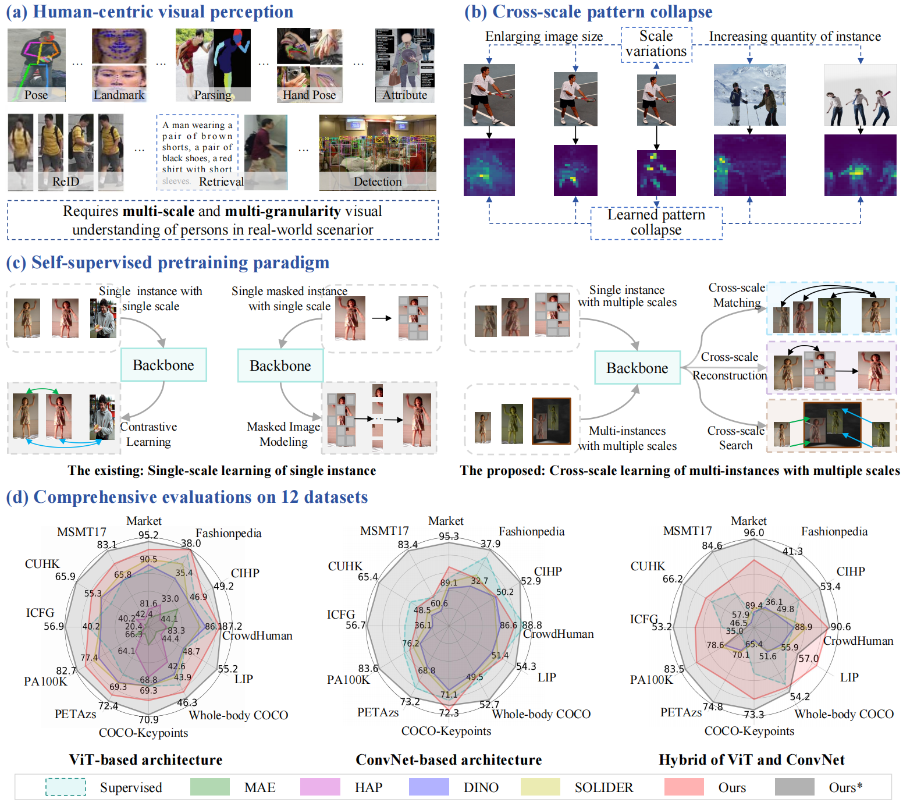
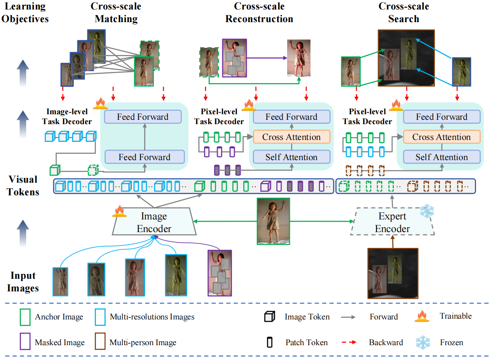

# SAIPv1

<div align="center"></div>

Self-supervised pretraining (SSP) on large models has achieved significant progress in human-centric visual perception (HVP). However, this progress comes with high computational costs due to the optimization of millions or even billions of parameters. Applying existing SSP approaches (e.g., contrastive learning and masked image modeling) directly to lightweight models presents a promising and resource-efficient alternative. Yet, existing methods focus on learning objectives designed for single instance at a single scale, making learned models vulnerable to scale variations (e.g., enlarging image size or increasing the quantity of instance). To address this limitation, we introduce Scale-Aware Image Pre-training (SAIP), the first SSP framework specifically designed to pretrain lightweight models for HVP. Specifically, SAIP bridges the gap of scale modeling between pretraining and downstream tasks through three complementary learning objectives: 1) Cross-scale Matching (CSM) which contrastively learns image-level invariant representations from multi-scale single-person images; 2) Cross-scale Reconstruction (CSR) which learns pixel-level consistent visual structures from multi-scale masked single-person images; and 3) Cross-scale Search (CSS) which learns to capture diverse patterns from multi-scale multi-person images. Three objectives complement one another, enabling SAIP to learn robust representations that support cross-scale consistency, a key property for general-purpose vision models in HVP. Comprehensive evaluations on 12 datasets reveal that SAIP significantly outperforms prior SSP methods, improving single-person discrimination tasks by 3%-13%, dense predictions by 1%-11%, and multi-person visual understanding by 1%-6%. These results demonstrate a remarkable generalization capability of SAIP.

<div align="center"></div>
## Updates
- **[2024/11/10: SOLIDER is accepted by CVPR2023!]**
    * The pytorch implementation of SAIP is released in this repo. 

## Installation
This codebase has been developed with python version 3.7, PyTorch version 1.7.1, CUDA 11.3 and torchvision 0.8.2. 

## Training
```
python -m torch.distributed.launch --nproc_per_node 8 main_pretrain.py --batch_size 64 --accum_iter 4 --model csl_vit_tiny_patch16 --data_path data/LUP1M --norm_pix_loss --epochs 300 --blr 2.5e-4 --weight_decay 0.05 --warmup_epochs 10 --height 256 --width 128 --crop_height 128 --crop_width 64 --global_crops_scale 0.8 1. --local_crops_scale 0.05 0.8 --output_dir work_dirs/lup1m_csl_vit_tiny --log_dir work_dirs/lup1m_csl_vit_tiny
```