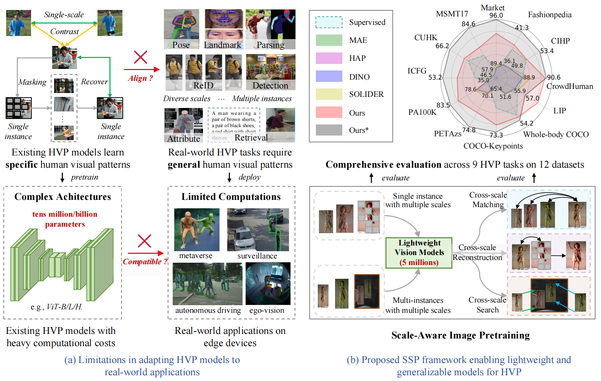

<div align="center"></div>

Human-centric visual perception (HVP) has recently achieved remarkable progress due to advancements in large-scale self-supervised pretraining (SSP). However, existing HVP models face limitations in adapting to real-world applications, which require general visual patterns for downstream tasks while maintaining computationally sustainable costs to ensure compatibility with edge devices. These limitations primarily arise from two issues: 1) the pretraining objectives focus solely on specific visual patterns, limiting the generalizability of the learned patterns for diverse downstream tasks; and 2) HVP models often exhibit excessively large model sizes, making them incompatible with real-world applications.
To address these limitations, we introduce Scale-Aware Image Pretraining (SAIP), a novel SSP framework enabling lightweight vision models to acquire general patterns for HVP. Specifically, SAIP incorporates three learning objectives based on the principle of cross-scale consistency: 1) Cross-scale Matching (CSM) which contrastively learns image-level invariant patterns from multi-scale single-person images; 2) Cross-scale Reconstruction (CSR) which learns pixel-level consistent visual structures from multi-scale masked single-person images; and 3) Cross-scale Search (CSS) which learns to capture diverse patterns from multi-scale multi-person images. Three objectives complement one another, enabling lightweight models to learn multi-scale generalizable patterns essential for HVP downstream tasks.
Extensive experiments conducted across 12 HVP datasets demonstrate that SAIP exhibits remarkable generalization capabilities across 9 human-centric vision tasks. Moreover, it achieves significant performance improvements over existing methods, with gains of 3%-13% in single-person discrimination tasks, 1%–11% in dense prediction tasks, and 1%–6% in multi-person visual understanding tasks.


## Updates
- **[2024/11/10: init code base]**
    * The pytorch implementation of SAIP is released in this repo. 

## Installation
This codebase has been developed with python version 3.7, PyTorch version 1.7.1, CUDA 11.3 and torchvision 0.8.2. 

## Training
```
python -m torch.distributed.launch --nproc_per_node 8 main_pretrain.py --batch_size 64 --accum_iter 4 --model csl_vit_tiny_patch16 --data_path data/LUP1M --norm_pix_loss --epochs 300 --blr 2.5e-4 --weight_decay 0.05 --warmup_epochs 10 --height 256 --width 128 --crop_height 128 --crop_width 64 --global_crops_scale 0.8 1. --local_crops_scale 0.05 0.8 --output_dir work_dirs/lup1m_csl_vit_tiny --log_dir work_dirs/lup1m_csl_vit_tiny
```